### Escuela Colombiana de Ingeniería
### Arquitecturas de Software - ARSW

## Escalamiento en Azure con Maquinas Virtuales, Sacale Sets y Service Plans

### Dependencias
* Cree una cuenta gratuita dentro de Azure. Para hacerlo puede guiarse de esta [documentación](https://azure.microsoft.com/es-es/free/students/). Al hacerlo usted contará con $100 USD para gastar durante 12 meses.
Antes de iniciar con el laboratorio, revise la siguiente documentación sobre las [Azure Functions](https://www.c-sharpcorner.com/article/an-overview-of-azure-functions/)

### Parte 0 - Entendiendo el escenario de calidad

Adjunto a este laboratorio usted podrá encontrar una aplicación totalmente desarrollada que tiene como objetivo calcular el enésimo valor de la secuencia de Fibonnaci.

**Escalabilidad**
Cuando un conjunto de usuarios consulta un enésimo número (superior a 1000000) de la secuencia de Fibonacci de forma concurrente y el sistema se encuentra bajo condiciones normales de operación, todas las peticiones deben ser respondidas y el consumo de CPU del sistema no puede superar el 70%.

### Escalabilidad Serverless (Functions)

1. Cree una Function App tal cual como se muestra en las  imagenes.

**FUNCTION APP:**

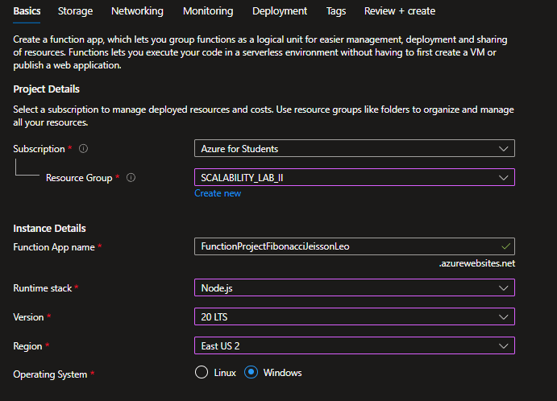
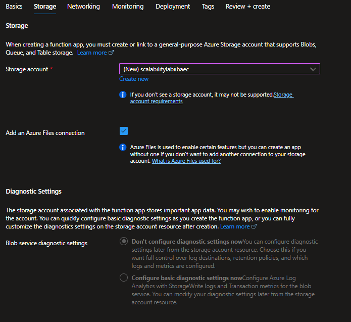

2. Instale la extensión de **Azure Functions** para Visual Studio Code.

3. Despliegue la Function de Fibonacci a Azure usando Visual Studio Code. La primera vez que lo haga se le va a pedir autenticarse, siga las instrucciones.

4. Dirijase al portal de Azure y pruebe la function.

**PRUEBAS:**

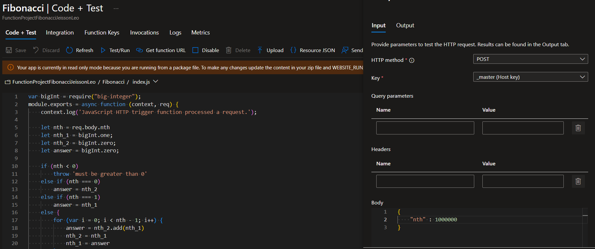
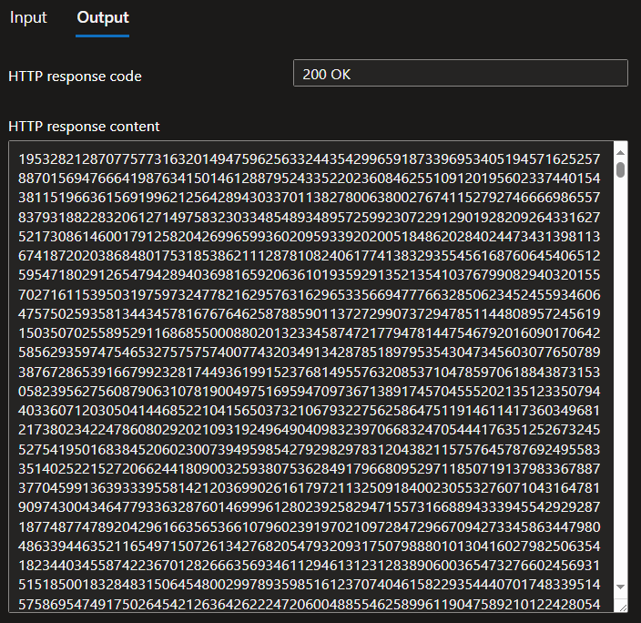

5. Modifique la coleción de POSTMAN con NEWMAN de tal forma que pueda enviar 10 peticiones concurrentes. Verifique los resultados y presente un informe.

Realizamos inicialmente la configuración del archivo .json utilizado en Postman para realizar las pruebas.
En este mismo definiremos las iteraciones para calcular el valor de fibonacci donde nth=100000

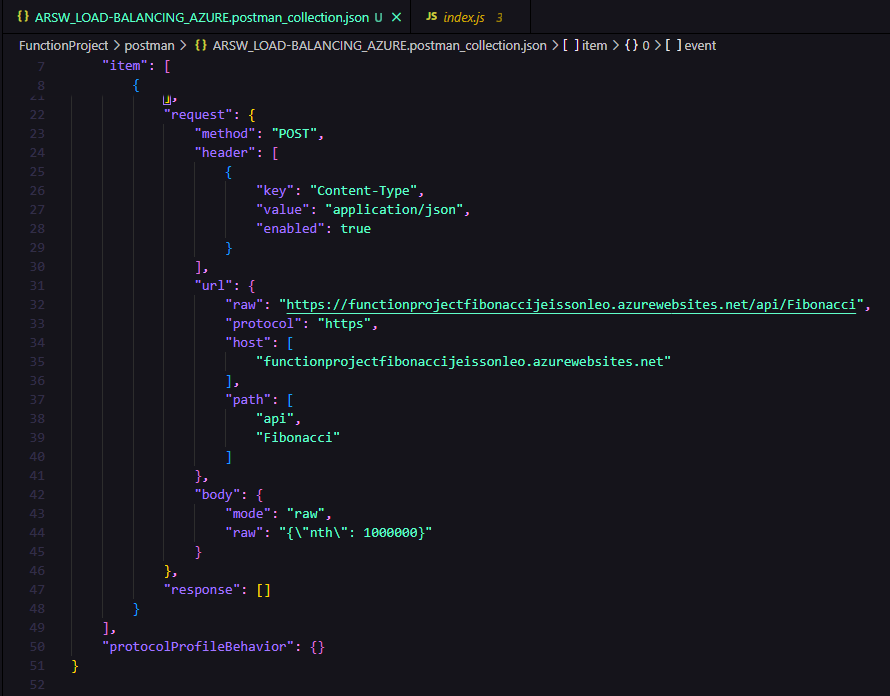

Se realiza la ejecución concurrente de la colección en Newman desde la terminal con el comando:
"newman run ARSW_LOAD-BALANCING_AZURE.postman_collection.json -n 10 &..."

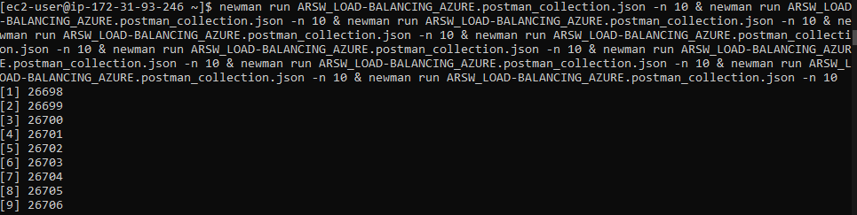

Aca podemos visualizar los resultados obtenidos por cada instancia, donde vemos que se realizaron las 10 iteraciones, no se obtuvieron errores y el tiempo total de ejecución fue de aproximadamente  2m 14s. Lo que refleja estabilidad y el desempeño correcto de la API sin fallos ni errores en la prueba.

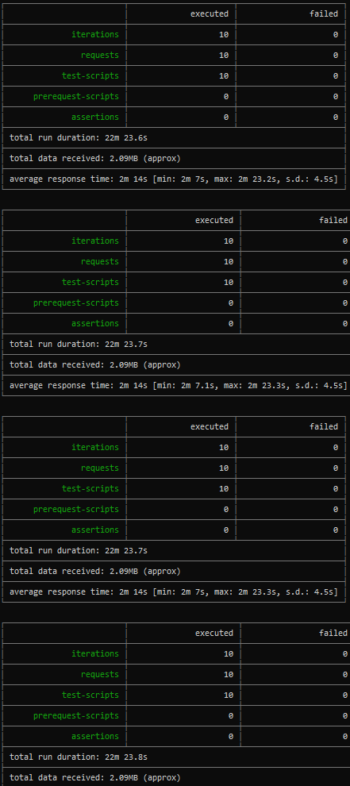

6. Cree una nueva Function que resuleva el problema de Fibonacci pero esta vez utilice un enfoque recursivo con memoization. Pruebe la función varias veces, después no haga nada por al menos 5 minutos. Pruebe la función de nuevo con los valores anteriores. ¿Cuál es el comportamiento?.

Realizamos la implementación con meoization

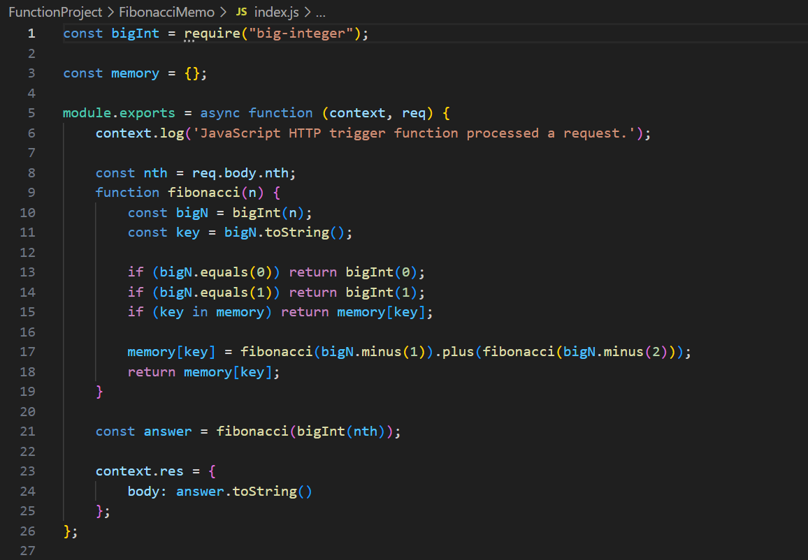

Probamos tiempos de ejecución, donde para el primer caso ingresamos nth=10000 y su tiempo de ejecución es de 148ms.

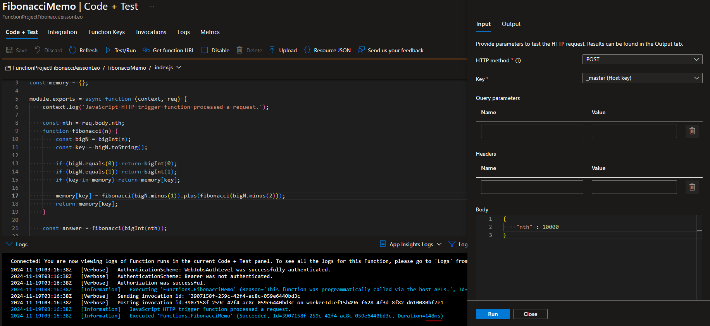

Despues de una segunda ejecución vemos que su duración disminuyo a 9ms.

En una siguiente ejecución pasados 5 minutos vemos que su duración disminuyo a 4ms.
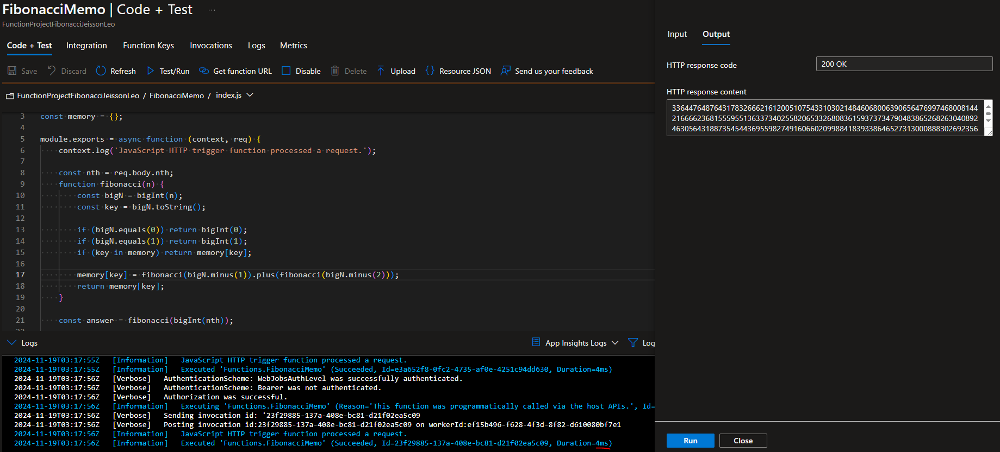

Tambien varia entre los 5ms, sin embargo se logro disminuir los tiempos de manera significativa.

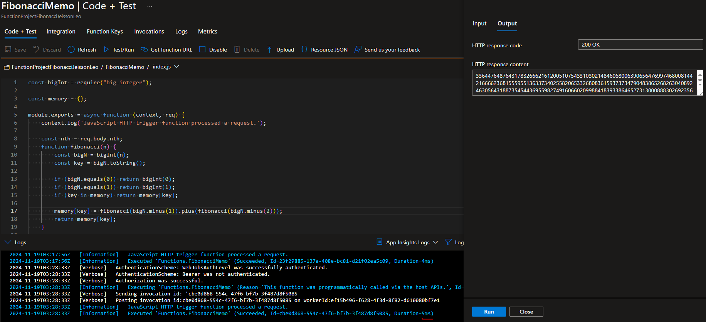

**Preguntas**

* ¿Qué es un Azure Function?

**RTA:**
Azure Function es un servicio de computación serverless que permite ejecutar pequeñas piezas de código (funciones) en la nube sin necesidad de gestionar infraestructura. Estas funciones son desencadenadas por eventos como solicitudes HTTP, colas de mensajes, actualizaciones en bases de datos, entre otros.

* ¿Qué es serverless?

**RTA:**
Serverless (sin servidor) es un modelo de computación en la nube donde el proveedor administra automáticamente la infraestructura necesaria para ejecutar el código.

* ¿Qué es el runtime y que implica seleccionarlo al momento de crear el Function App?

**RTA:**
El runtime es el entorno donde se ejecutan las funciones de Azure. Define el lenguaje y las bibliotecas que la función puede usar.

Implicaciones al seleccionar el runtime:
1. Debe ser compatible con el lenguaje de programación de la función.
2. Afecta la disponibilidad de ciertas características y librerías.
3. Una vez seleccionado, no puede cambiarse; se necesita crear un nuevo Function App si es necesario otro runtime.

* ¿Por qué es necesario crear un Storage Account de la mano de un Function App?

**RTA:**
Sin un Storage Account, no sería posible gestionar de forma efectiva las operaciones internas de Azure Functions como Control de colas, disparadores, Gestión de escalabilidad y logs del servicio.

* ¿Cuáles son los tipos de planes para un Function App?, ¿En qué se diferencias?, mencione ventajas y desventajas de cada uno de ellos.

**RTA:**

Consumption Plan:

1. Escalabilidad: Escala automáticamente según la demanda.
2. Facturación: Pago por el tiempo de ejecución y el número de ejecuciones.
*Ventajas:*
a. Costo eficiente para cargas esporádicas o impredecibles.
*Desventajas:*
a. Latencia inicial (cold start) cuando no hay solicitudes recientes.

Premium Plan:

1. Escalabilidad: Similar al consumo, pero mantiene instancias siempre activas.
2. Facturación: Basada en núcleos de CPU y memoria utilizados.
*Ventajas:*
a. Sin latencia de cold start.
b. Compatible con redes virtuales.
*Desventajas:*
c.Más costoso que el Consumption Plan.

Dedicated (App Service) Plan:

1. Escalabilidad: Requiere configuración manual.
2. Facturación: Basada en instancias de VM reservadas.
*Ventajas:*
a. Ideal para funciones con alta demanda constante.
Control total de la infraestructura.
*Desventajas:*
a. No escala automáticamente.
b. Más costoso si no se usa al máximo.

* ¿Por qué la memoization falla o no funciona de forma correcta?

La memoización puede fallar debido a que los llamados recursivos pueden provocar un desbordamiento de la pila, es decir, al usar valores muy grandes supera la memoria disponible arrojando error. Además, al inicio no hay valores almacenados en memoria, lo que obliga a calcularlos desde cero.

* ¿Cómo funciona el sistema de facturación de las Function App?

El sistema de facturación de Azure Functions depende del tipo de plan elegido. 
En el Consumption Plan, se cobra por el tiempo de ejecución y el número de ejecuciones, con un nivel gratuito mensual de 1 millón de ejecuciones y 400,000 GB-s. 
En el Premium Plan, se factura según los núcleos de CPU y memoria reservados. 
Mientras que en el Dedicated Plan, el costo se basa en el uso de instancias de App Service. Adicionalmente, los servicios externos usados, como almacenamiento o colas, generan costos adicionales.

* Informe

Realizado a lo largo del Readme
